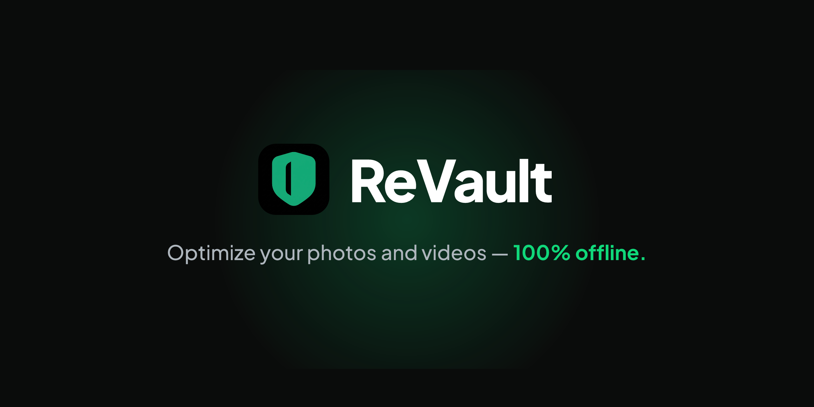

<div align="center">




[Discussions](https://github.com/revaultapp/revault/discussions) · [Issues](https://github.com/revaultapp/revault/issues) · [Security](SECURITY.md)

</div>

<!-- demo GIF goes here (visual assets tier) -->

ReVault is an offline-first desktop app that compresses, converts, and cleans up your photos and videos — fast, private, and entirely on your machine.

## Privacy & Offline

- 100% local processing — images and video never leave your machine
- No account, no server, no cloud
- No telemetry, no tracking
- Open source and auditable — all processing logic lives in `src-tauri/src/core/`

## Features

- **Compress** — JPEG (mozjpeg), PNG (oxipng), WebP, AVIF, with quality control
- **Convert** — HEIC (native decode), PNG, JPEG, WebP, with batch processing
- **Resize** — batch image resize with anti-upscaling safeguards
- **Duplicates** — find exact duplicates (SHA256) or perceptually similar images (pHash)
- **Privacy** — strip EXIF, GPS, camera info, and metadata from images
- **Video** — compress with CRF presets, privacy modes, MOV→MP4 remux, lossless trim
- **GIF Export** — create animated GIFs from video clips via gifski
- **PDF Tools** — strip metadata, compress streams, and merge/split PDFs

## Installing

An unsigned build is normal for a small open-source project, not a red flag — the warnings below appear because the app isn't code-signed yet, not because it's unsafe. The source is fully auditable in this repo.

Download the latest release for your platform and bypass the warning as follows:

- **macOS:** On first launch, macOS will block the app (Gatekeeper). Go to **System Settings → Privacy & Security** and click the **Open Anyway** button next to ReVault. Alternatively, remove the quarantine flag in Terminal:
  ```bash
  xattr -dr com.apple.quarantine /Applications/ReVault.app
  ```

- **Windows:** When SmartScreen appears, click **More info** → **Run anyway**.

Signed and notarized builds are planned for a future release.

## Tech Stack

- **Backend:** Rust
- **Frontend:** Svelte 5 + TypeScript
- **Framework:** [Tauri v2](https://v2.tauri.app/)
- **Build:** Vite

## Development

### Prerequisites

- [Rust](https://rustup.rs/) (latest stable)
- [Node.js](https://nodejs.org/) (v20+)
- [pnpm](https://pnpm.io/)
- [Tauri prerequisites](https://v2.tauri.app/start/prerequisites/)

### Setup

```bash
pnpm install
pnpm tauri dev
```

### Run Rust tests

```bash
cd src-tauri
cargo test
```

## Contributing

See [CONTRIBUTING.md](CONTRIBUTING.md).

## Security

Please report vulnerabilities privately rather than opening a public issue — see [SECURITY.md](SECURITY.md).

## License

[MIT](LICENSE)
